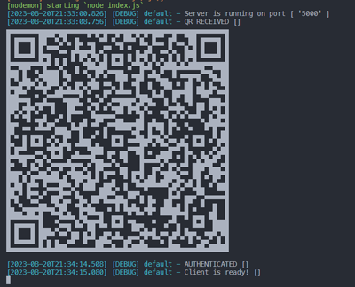
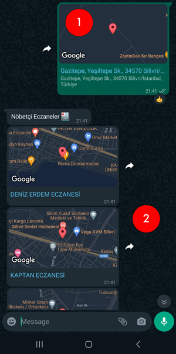
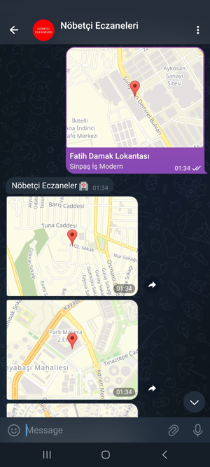

# WhatsApp/Telegram BOT sending Nearby Locations for İstanbul Nöbetçi Eczaneleri
### WhatsApp/Telegram BOT, İstanbul Nöbetçi Eczaneleri için Yakın Konumlar gönderiyor

Now works for only İstanbul, All turkey cities will come soon in the next update.

## WhatsApp

This project connects through the WhatsApp Web browser app
It uses Puppeteer to run a real instance of Whatsapp Web to avoid getting blocked.

NOTE: I can't guarantee you will not be blocked by using this method, although it has worked for me. WhatsApp does not allow bots or unofficial clients on their platform, so this shouldn't be considered totally safe.

## Telegram
using Telegram Bot API.
### Installation
```
npm i
```
### Usage
```
node . | nodemon
```
- After that scan QR code `using your whatsapp` from console area, then BOT will start work on your account and reply to any location available with nearby Nöbetçi Eczaneleri.

### Screenshots

- QR code for scan step after run command `nodemon`



- [1] Location sent to WhatsApp number / Telegram BOT.
- [2] All `Nöbetçi Eczaneleri` founds nearby your area.





